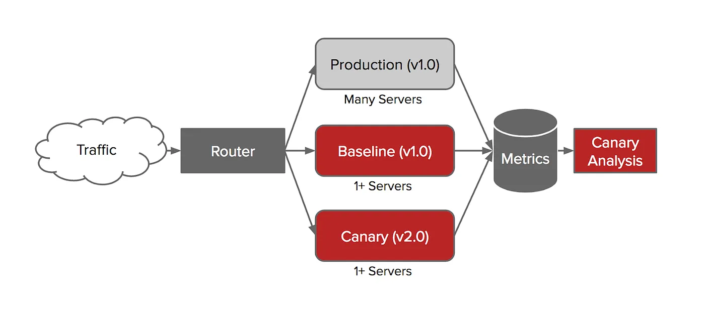

---
# try also 'default' to start simple
theme: apple-basic
layout: intro
colorSchema: dark
# random image from a curated Unsplash collection by Anthony
# like them? see https://unsplash.com/collections/94734566/slidev
# background: https://cover.sli.dev
# apply any unocss classes to the current slide
#class: 'text-center'
# https://sli.dev/custom/highlighters.html
#highlighter: shiki
# some information about the slides, markdown enabled
info: |
  ## Slidev Starter Template
  Presentation slides for developers.

  Learn more at [Sli.dev](https://sli.dev)
transition: slide-left
title: The Art of Uniting Testing 3rd Edition sharing
---
# The Art of Unit Testing 3rd Edition
CH10 and CH11

<div class="absolute bottom-10">
  <span class="font-700">
    Reading notes by Kent Chen
  </span>
</div>

<!--
The last comment block of each slide will be treated as slide notes. It will be visible and editable in Presenter Mode along with the slide. [Read more in the docs](https://sli.dev/guide/syntax.html#notes)
-->

---
layout: default
dragPos:
  diagram: 111,89,440,440
  complex: 562,107,61,40
  simple: 562,481,47,40
  flaky: 633,107,40,40
  stable: 630,482,40,54
  hard_maintain: 669,89,75,40
  easy_maintain: 683,482,54,40
  fast: 757,481,23,18
  slow: 755,105,56,40
---

# Common test types and levels / Test Recipe 


<v-drag-arrow two-way pos="582,132,-2,340" width="1" />
<AutoFitText v-drag="'complex'" :min="12" :max="12" modelValue="Complex"/>
<AutoFitText v-drag="'simple'" :min="12" :max="12" modelValue="Simple"/>
<v-drag-arrow two-way pos="649,132,-2,340" width="1" />
<AutoFitText v-drag="'flaky'" :min="12" :max="12" modelValue="Flaky"/>
<AutoFitText v-drag="'stable'" :min="12" :max="12" modelValue="Stable"/>
<v-drag-arrow two-way pos="708,132,-4,341" width="1" />
<AutoFitText v-drag="'hard_maintain'" :min="12" :max="12" modelValue="Hard To Maintain" style="text-align:center"/>
<AutoFitText v-drag="'easy_maintain'" :min="12" :max="12" modelValue="Easy To Maintain" style="text-align:center"/>
<v-drag-arrow two-way pos="772,133,-4,341" width="1" />
<AutoFitText v-drag="'fast'" :min="12" :max="12" modelValue="Fast" />
<AutoFitText v-drag="'slow'" :min="12" :max="12" modelValue="Slow" />

---
layout: default
dragPos:
  diagram: 68,169,361,358
  reference: 446,493,382,150
---

# Test-level antipatterns

* A very common strategy that an organization will have is using mostly, if not only, E2E tests (both isolated and system tests).


<div v-drag="'reference'">
  <a style="color:grey;font-style:italic;" href="https://medium.com/johnliu-%E7%9A%84%E8%BB%9F%E9%AB%94%E5%B7%A5%E7%A8%8B%E6%80%9D%E7%B6%AD/google-%E7%9A%84%E8%BB%9F%E9%AB%94%E5%B7%A5%E7%A8%8B%E4%B9%8B%E9%81%93-11-%E5%A4%A7%E5%9E%8B%E6%B8%AC%E8%A9%A6-21e5012acf02">From: Google 的軟體工程之道 (11) — 大型測試</a>
</div>

---
dragPos:
  person: 242,128,449,326
---

# AVOIDING BUILD WHISPERERS


---
layout: default
dragPos:
  netflix: 191,141,595,320
  reference: 340,466,448,26
---

# Netflix's Solution - Automated Canary Analysis


<div v-drag="'reference'">
  <a style="color:grey;font-style:italic;" href="https://netflixtechblog.com/automated-canary-analysis-at-netflix-with-kayenta-3260bc7acc69">From: Automated Canary Analysis at Netflix with Kayenta</a>
</div>

---
layout: default
---

## When this anti-pattern happens

- Separation of duties
- An “if it works, don’t change it” mentality
- Sunk-costs fallacy

## Anti-behaviors:
- Many of the tests repeat in multiple levels.
- The people who write the low-level tests are not the same people who write the
high-level tests
- We suffer the worst of both worlds.

# Aboves are why we need test recipe
---
layout: default
---
## Guide to write test recipes (1/2)
- At least two people.
- Before you start working on the feature.
- A recipe can change as time goes by.
- As a rule of thumb, to have a 1 to 5 or 1 to 10 ratio between levels of tests.
- A recipe is a simple list of 5 to 20 lines of text detailing simple scenarios to be tested in an automated fashion and at what level.
```
Example: User profile feature testing recipe
       E2E – Login, go to profile screen, update email, log out, log in with new
            email, verify profile screen updated
       API – Call UpdateProfile API with more complicated data
        Unit test – Check profile update logic with bad email
        Unit test – Profile update logic with same email
        Unit test – Profile serialization/deserialization
```
---
transition: default
---
## Guide to write test recipes (2/2)

- Discuss at which level that scenario (5 to 15 minutes).
- Low-level and high level tests are working at the same time. One does not wait for the other to finish their work before starting to write their tests.
---
layout: default
dragPos:
  deliveryPipeline: 53,101,746,190
  discoveryPipeline: 54,326,746,192
  complex: 193,295,672,43
---

# Delivery vs. discovery pipelines


<AutoFitText v-drag="'complex'" :min="12" :max="12" modelValue="Don’t do nightly builds! It’s best to run your delivery pipeline after every code commit, instead of at a certain time." />


---
layout: default
dragPos:
  parallelDeliveryPipeline: 27,110,780,192
  discoveryPipeline: 29,339,830,168
  parallelDiscoveryPipeline: 23,317,785,207
---

# Test layer parallelization


---

# Comparison of security scan tools (Based on my personal experience)

- CI/CD Integration
  - Gitlab = Snyk > WhiteSource > Veracode
- Security Flaws Scan
  - Veracode > Snyk (a little more false positive cases)
- IDE Extensions Support
  - Snyk > Veracode
- License Scan and policy management
  - WhiteSource > Gitlab > Veracode
- UI
  - Snyk > gitlab >>> Veracode  

---
preload: false
---

# Integrating unit testing into the organization

- Be prepared for the tough questions
- Champions and blockers
- Identify possible starting points
  - Choose smaller teams.
  - Create subteams.
  - Consider project feasibility.
  - Use code and test reviews as teaching tools.
    - Do the reviews in person (WFH?)
    - Add a third person to your code reviews
---
preload: false
---

# Ways to succeed (1/2)

- Guerrilla implementation (bottom-up)
  - Choose smaller teams, create subteams.
- Convincing management (top-down)  
  - Manager
  - Devloper
- Experiments as door openers
  - Such an approach helps people feel more at ease with big changes, because it reduces the risk to the organization, the number of people affected
- METRICS AND EXPERIMENTS
  - Be sure to record a baseline set of metrics before and after the experiment.

---
dragPos:
  testReport: 483,77,496,456
---

# Ways to succeed (2/2)

- Get an outside champion
  - Freedom to speak
  - Experience
  - Dedicated time
- Make progress visible


---
layout: default
---
# Aim for specific goals, metrics, and KPIs (1/2)

- At the organizational level, unit tests are generally part of a bigger set of goals, usually related to continuous delivery.
- Four common DevOps metrics (Lagging indicators):
  - Deployment frequency
  - Lead time for changes
    - The time it takes a feature request to get into production. Note that many places incorrectly publish this as the amount of time it takes a commit to get into production.
  - Escaped bugs/change failure rate
  - Time to restore service
---
layout: defualt
dragPos:
  testReport: 264,101,723,646
  metrics: 323,97,648,435
---

# Aim for specific goals, metrics, and KPIs (2/2)
- Leading indicators
  - Coverage
  - Number of tests
  - Build run time
- Qualitative Metrics
  - Survey by confidence 
  level


---
layout: default
dragPos:
  influences: 447,69,539,446
---

# Ways to fail

- Lack of a driving force
- Lack of political support
- Ad hoc implementations and first impressions
- Lack of team support
- Influence factors checklist


---
layout: defulat
dragPos:
  teamProgress: 48,168,657,368
---

# Tough questions and answers (1/3)

- How much time will unit testing add to the current process?
  - Different people care about different scopes, your answers may vary. 


---
preload: false
---

# Tough questions and answers (2/3)

- Will my QA job be at risk because of unit testing?
- Is there proof that unit testing helps?
- Why is the QA department still finding bugs?
  - Unit tests give you fast feedback and easy maintainability, but they leave some confidence behind, which can only be gained through some levels of integration tests.
- We have lots of code without tests: Where do we start?
  - Typically, 80% of bugs are found in 20% of the code. To find the code that has the most problems.
- What if we develop a combination of software and hardware?
  - Hardware testing usually requires the use of simulators and emulators at various levels.

---
preload: false
---

# Tough questions and answers (3/3)

- How can we know we don’t have bugs in our tests?
  - TDD
- Why do I need tests if my debugger shows that my code works?
  - Debuggers don’t help much with multithreaded code.
  - What about other people’s code?
  - When requirements changes, you’ll be glad you have tests for everything else, to make sure you don’t break it.
---
Layout: default
---

# Retrospec

- Without Test Recipe.
- Disconnected low-level and high-level tests.
  - The people who write the low-level tests are not the same people who write the high-level tests. This means they don’t care about each other’s test results.
- Build Whipser exists.
---
layout: center
class: text-left
---

# Learn More

- [Automated Canary Analysis at Netflix with Kayenta](https://netflixtechblog.com/automated-canary-analysis-at-netflix-with-kayenta-3260bc7acc69) 
- [WHAT IS A PIPELINE DRIVEN ORGANIZATION](https://pipelinedriven.org/) 
- [GOOD CODE REVIEW](https://www.5whys.com/articles/what-should-a-good-code-review-look-and-feel-like.html)
- [LIES, DAMNED LIES AND METRICS](https://pipelinedriven.org/article/video-lies-damned-lies-and-metrics)
- [A METRICS FRAMEWORK FOR CONTINUOUS DELIVERY](https://pipelinedriven.org/article/a-metrics-framework-for-continuous-delivery)
- [Statistics & Studies: The Benefits Of Test Driven Development](https://theqalead.com/general/statistics-studies-benefits-test-driven-development/)
- [Google 的軟體工程之道 — 大型測試](https://medium.com/johnliu-%E7%9A%84%E8%BB%9F%E9%AB%94%E5%B7%A5%E7%A8%8B%E6%80%9D%E7%B6%AD/google-%E7%9A%84%E8%BB%9F%E9%AB%94%E5%B7%A5%E7%A8%8B%E4%B9%8B%E9%81%93-11-%E5%A4%A7%E5%9E%8B%E6%B8%AC%E8%A9%A6-21e5012acf02)
- [Google 的軟體工程之道 — 大型測試 (英文)](https://abseil.io/resources/swe-book/html/ch14.html#:~:text=An%20example%20system%20under%20test%20(SUT))
